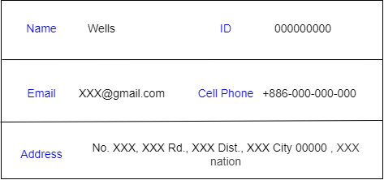
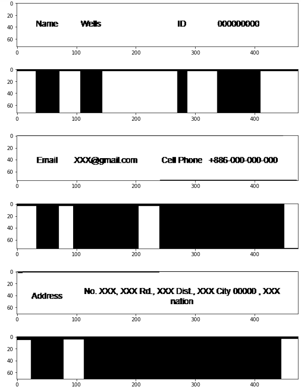
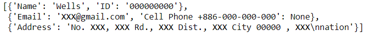

# OCR_Form
prerequisite: please install Tesseract and check your computer environment.
## Original image

## Part 1: Process Image with Morphology
### Separate each line and find the position of value by morphology with OpenCV

## Part 2: Crop the Location of the Words in the Image and OCR
### Crop the image and transfer each value to strings with Tesseract

